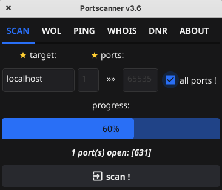
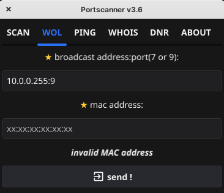
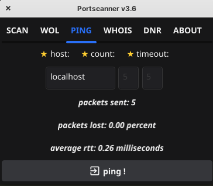
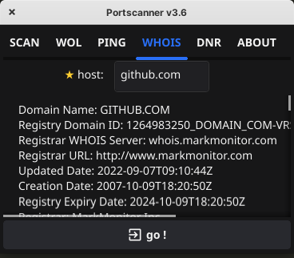
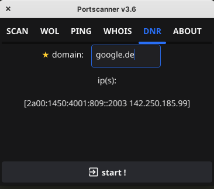
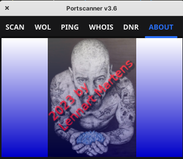

<p align="center"></p>
is a simple yet powerful tool built using Go and the Fyne toolkit, designed to help you scan a range of ports on a given host. The graphical interface is intuitive, making it easy to specify the target host and range of ports to scan. As the scan progresses, you'll be able to see the progress and any open ports that are found. Releases for Linux, Windows and Android !

**Version 3.6: Multithreading scan with up to 100 threads parallel - very fast !**


<p align="center">
  
  
  
  
  
  
</p>

## Features

- Scan a range of ports on a target host.
- Display the progress of the scan in real-time.
- Display open ports as they are found.
- Option to scan all ports (1-65535) with a single click.
- Wake on LAN
- Ping
- Whois
- Domain Name Resolution

## Installation

Before running the program, ensure that you have Go installed on your machine. You'll also need the Fyne toolkit.

1. Clone the repository to your local machine:
```bash
git clone https://github.com/lennart1978/portscannerv3.0.git
cd portscannerv3.0
go get fyne.io/fyne/v2
go mod tidy
go run .
